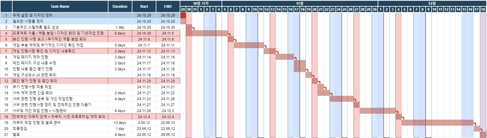
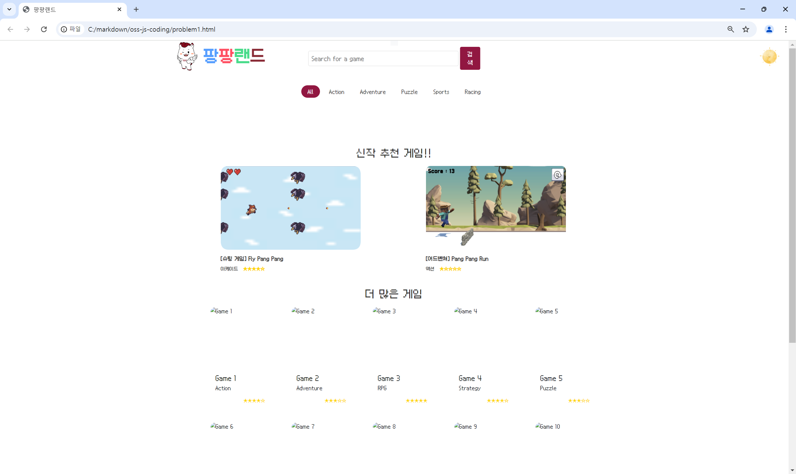
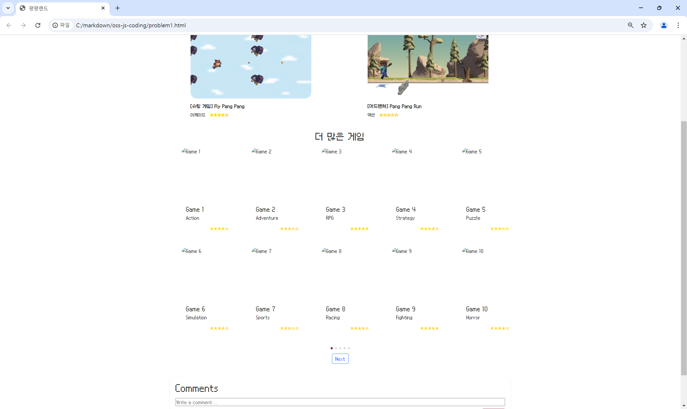

<h1>Progress Report For Team 4</h1>

<h2>Progress Summary</h2>

게임 실행및 개인 게임 공유 웹 홈페이지를 위해서 현재 
<b>게시용 게임 개발 완료</b>

<b>게임 페이지 디자인 완료</b>

<b>메인 페이지 디자인 프로토타입 제작 완료</b>

<b>현재 서버 구축 진행중</b>

<b>Project Schedule</b>

<b>Project Screenshoot</b>

<h2>Individual Progress Status</h2>
<b>김동현</b>

- 총괄

- 게임 페이지 제작<a href="https://github.com/ehdgus3130/Run-Jump"> (commit)</a>

- 게임 페이지 서버 구축

 
<b>박원국</b>

- 게임 페이지 제작 <a href="https://github.com/parkwonkuku/OSS-4_teamproject">  (commit) </a>

- 전체 페이지 디자인

- 게임 페이지 서버 구축

 
<b>정승수</b>

- 메인 페이지 제작 및 시스템 디자인 <a href="https://github.com/Chungss84/oss4team_server"> (commit) </a>

- 메인 페이지 서버 구축

 
<b>백민재</b>

- 메인 페이지 제작 및 UI/UX 디자인 <a href="https://github.com/akswo/GameWeb"> (commit) </a>

- 메인 페이지 서버 구축
