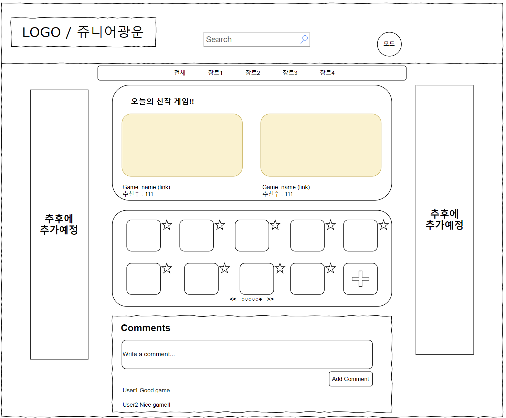
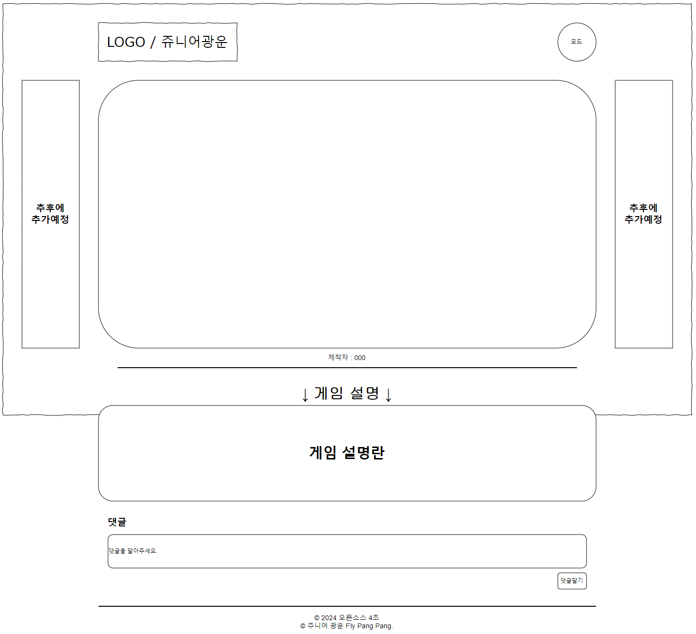

### KW_OSS_4TeamProject 🖍️
 오픈소스 4조 **주니어 광운** 입니다.
  
 
  

 

### 📝 홈페이지 소개
- 짧고 가볍게 게임을 즐기고 싶은 분!

- 다양한 게임을 즐기고 싶은 분!

- 내가 만든 플래시 게임을 공유하고싶은 분!

- 나만 알고 있는 재밌는 플래시 게임을 공유하고싶은 분!

이러한 분들을 위한 플래시 게임 모음 사이트입니다!

다양한 장르의 게임들을 직접 플레이할 수 있고, 원하는 장르를 선택하여 게임을 즐길 수 있습니다.

또한 기존에 없던 게임을 업로드함으로써 다양한 게임을 공유하며 더욱 즐길 수 있으며 추천 버튼을 통해 게임을 추천 및 게시판을 통한 다양한 사람들과 
다양한 의견을 나눌 수 있습니다.

 

## 페이지별 주요 기능
- 메인 페이지
  - 다양한 장르의 플래시 게임 모음
  - 기존에 없던 게임 추가
  - 게임 추천 및 댓글
  - 다크 / 라이트 모드
- 게임 페이지
  - 직접적인 게임 플레이
  - 댓글
  - 다크 / 라이트 모드

 

## 화면 구성
|웹 디자인 구성| 게임화면 |
|:---:| :---: |
|||
|기본적인 홈페이지 예상 구성화면|게임 플레이시 예상 구성화면|

 

## 각 페이지 디자인
| 메인 페이지 | 게임 페이지 |
|:---:| :---: |
|||
|메인 페이지 디자인 ver 2|게임 페이지 디자인 ver 2|

 

## ⚙ 사용한 도구
### Front-end

### Tools

 

## 🤔 프로젝트 일정
- 11월 둘째주
    - 프로젝트 이름/ 진행하는 내용에 대한 디자인 구상/각자 역할분담 관련 회의
    - 본인 역할 웹 구현 및 추가적인 의견 제시
- 11월 셋째주
    - 중간 점검 및 추가적인 피드백 진행 회의
    - 프로젝트 방향성 및 전체적인 디자인 완료 / 게임 제작 진행
- 11월 넷째주
    - 서버 구현 관련 추가 의논 진행
    - 게임 및 디자인 확인  / 게임 마무리 검토
- 11월 다섯째주
    - 전체적인 마무리 단계진행
    - 마무리 다듬기 과정 및 피드백
- 12월 첫째주
    - 마무리 검토 진행
- 12월 둘째주
    - 최종 점검
 

[https://www.notion.so/13d709db824d80158438ce8f2180ed39](https://www.notion.so/13d709db824d80158438ce8f2180ed39)

## 💁‍♂️ 프로젝트 팀원
- [김동현 2020202023](https://github.com/ehdgus3130)
    - 총괄
    - 게임 및 게임 페이지 제작
- [박원국 2021202069](https://github.com/parkwonkuku)
    - 게임 및 게임 페이지 제작
    - 각 페이지 디자인
- [백민재 2020202087](https://github.com/akswo)
    - 메인 페이지 제작
- [정승수 2020202063](https://github.com/Chungss84)
    - 메인 페이지 제작

- 공통 작업 : 서버 구축
